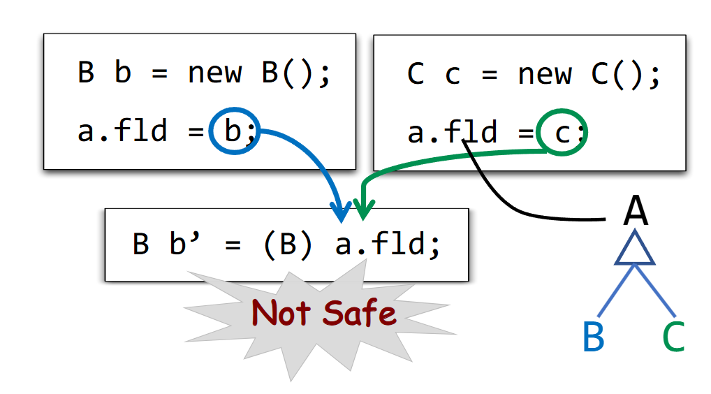

>本文整理自南京大学（NJU）《软件分析》
>
>[南京大学 Static Program Analysis](https://tai-e.pascal-lab.net/lectures.html)
## Introduction

### 莱斯定理（Rice's Theorem）

>"Any non-trivial property of the behavior of programs in a r.e. language is undecidable"

不存在 *Perfect static analysis*

### Sound & Complete

| Sound           | Truth                               | Complete         |
| --------------- | ----------------------------------- | ---------------- |
| Overapproximate | All possible true program behaviors | Underapproximate |

报告范围 *Sound* 会更多，为了保证程序可靠，会尽可能多地报 bug，但是可能存在误报。*Complete* 为了确保不“冤枉”程序，会保证所报的 bug 均是确切的 bug，从而导致漏报。

几乎所有的静态分析都是 *Sound*，如图：



图中仅分析了蓝色路径会得到错误的结论 —— *Safe Cast*，而 *Sound* 需要考虑到所有的情况进而得到 *Not Safe Cast* 的结论。

***Useful Static Analysis* —— 在 *Sound* 的前提下，精度与速度间进行有效平衡。**

### Abstraction & Over-approximation

​ *abstraction* 是把具体域映射成抽象域。e.g. 抽象域可以包括：

$$
+、 -、 0、 \top\text{(unknown)}, \bot\text{(undefined)}
$$

，*over-approximation* 再对抽象域进行运算关系 (transfer functions) 与控制流 (control flow) 的近似。


## Intermediate Representation

### Compiler


### AST vs. IR

```c
// do i = i + 1; while (a[i] < v)

IR 三地址码
1: i = i + 1
2: t1 = a[i]
3: if t1 < v goto 1
```

| AST                     | IR      |
| ----------------------- | ------- |
| 高级并贴合 grammar structure | 低级并接近汇编 |
| 依赖不同的编程语言               | 和其他语言无关 |
| 缺乏控制流信息 e.g.不能清晰看出循环    | 包含控制流信息 |

### 3-Address Code(3AC)

右侧只能有一个操作符，e.g.

```c
c = a + b + 3 => t1 = a + b; c = t1 + 3;
```

地址（*Address*）可以由以下部分组成:

- Name: a, b, c
- Constant: 3
- Compiler-generated temporary: t1

#### 常见的三地址码形式

```c
x = y bop z
x = uop y
x = y
goto L
if x goto L
if x rop y goto L

/**
x, y, z: addresses
bop: binary arithmetic or logical operation
uop: unary operation (minus, negation, casting)
L: a label to represent a program location
rop: relational operator (>, <, ==, >=, <=, etc.)
goto L: unconditional jump
if … goto L: conditional jump
**/
```

### Static Single Assignment(SSA)

- Give each definition a fresh name
- Propagate fresh name to subsequent uses
- Every variable has exactly one definition

```c
// 3AC
p = a + b
q = p - c
p = q * d
p = e - p
q = p + q

// SSA
p1 = a + b
q1 = p1 - c
p2 = q1 * d
p3 = e - p2
q2 = p3 + q1
```

### Control Flow Analysis

- Usually refer to building Control Flow Graph (CFG)
- CFG serves as the basic structure for static analysis
- The node in CFG can be an individual 3-address instruction, or (usually) a Basic Block (BB)

#### Basic Blocks(BB)

Basic blocks (BB) are maximal sequences of consecutive three-address instructions with the properties that.

- 入口为第一个指令
- 出口为最后一个指令

>禁止中途进出


#### Control Flow Graphs(CFG)

- The nodes of CFG are basic blocks
- There is an edge from block A to block B if and only if
    - There is a conditional or unconditional jump from the end of A to the beginning of B
    - B immediately follows A in the original order of instructions and A does not end in an unconditional jump
- It is normal to replace the jumps to instruction labels by jumps to basic blocks

## Data Flow Analysis

>How Data Flows on CFG

Data-flow analysis is to find a solution to a set of *safe-approximation-directed constraints* on the IN[s]’s and OUT[s]’s, for all statements.
- constraints based on semantics of statements (*transfer functions*)
- constraints based on the *flows of control*
### Notations for Constraints

#### Transfer Function


#### Control Flow


### Applications

#### Reaching Definitions Analysis

**基本概念**

- 假定 x 有定义 d (*definition*)，如果存在一个路径，从紧随 d 的点到达某点 p，并且此路径上面没有 x 的其他定义点，则称 x 的定义 d 到达 (*reaching*) p。
- 如果在这条路径上有对 x 的其它定义，我们说变量 x 的这个定义 d 被杀死 (*killed*) 了


在实践中这个算法可以用来检测未定义的变量：e.g. 每一个变量 v 在 CFG 入口会有一个虚拟定义（*dummy definition*），虚拟定义 v 到达使用 v 的某点 p 时，那么 v 可能会在定义前被使用。
##### Transfer Function & Control Flow


##### Algorithm

```c
OUT[entry] = NULL;
for (each basic block B(排除 entry)) {
	OUT[B] = NULL;
}
while (changes to any OUT occur) {
	for (each basic block B(排除 entry)) {
		IN[B] = Union(所有前驱 OUT[P]);
		OUT[B] = gen(B) Union (IN[B] - kill(B));
	}
}
```

e.g.


- 首先让所有 *BB* 和入口的 *OUT* 为空。因为你不知道 *BB* 中有哪些 *D（definition）*。
- 当任意 *OUT* 发生变化，则分析出的定值可能需要继续往下流动，所需要修改各 *BB* 的 *IN* 和 *OUT*。
- 先处理 *IN*，然后再根据转移方程完成更新 *OUT*。
- 在转移方程中，*kill* 与 *gen* 相关的 bit 不会因为 *IN* 的改变而发生改变，而其它 bit 又是通过对前驱 *OUT* 取并得到的，因此其它 bit 不会发生 1 => 0 的情况。所以，*OUT* 是不断增长的，而且有上界，因此算法最后必然会停止。
- 因为 *OUT* 没有变化，不会导致任何的 *IN* 发生变化，因此 *OUT* 不变可以作为终止条件。我们称之为程序到达了不动点（*Fixed Point*）

#### Live Variables Analysis

**基本概念**

- 变量 x 在程序点 p 上的值是否会在某条从 p 出发的路径中使用
- 变量 x 在 p 上活跃，当且仅存在一条从 p 开始的路径，该路径的末端使用了 x，且路径上没有对 x 进行覆盖。

>在被使用前，v 没有被重新定义过，即没有被 kill 过。


这个算法可以用于寄存器分配。
##### Transfer Function & Control Flow


##### Algorithm

```c
IN[exit] = NULL;
for (each basic block B(排除 exit)) {
	IN[B] = NULL;
}
while (changes to any IN occur) {
	for (each basic block B(排除 exit)) {
		OUT[B] = Union(所有后继 IN[S]);
		IN[B] = use(B) Union (OUT[B] - def(B));
	}
}

```

e.g.


- 考虑 *BB* 及其后继 *S*。若 *S* 中，变量 *v* 被使用，那么我们就把 *v* 放到 *S* 的 IN 中，交给 *BB* 来分析。
- 在一个 *BB* 中，若变量 *v* 被使用，那么我们需要添加到我们的 IN 里。而如果 *v* 被定义，那么在其之上的语句中，*v* 都是一个非活跃变量，因为没有语句再需要使用它。
- 对于转移方程，IN 是从后继 OUT 中删去重新赋值的变量，然后并上使用过的变量。在同一个 *BB* 中，变量 *v* 的 def 先于 use ，那么实际上效果和没有 use 是一样的。
#### Available Expressions Analysis

**基本概念**

- x + y 在 p 点可用的条件：从流图入口结点到达 p 的每条路径都对 x + y 求了值，且在最后一次求值之后再没有对 x 或 y 赋值

如果一个表达式上次计算的值到这次仍然可用，我们就能直接利用其中值，而不用进行再次的计算。
##### Transfer Function & Control Flow


##### Algorithm

```c
OUT[entry] = NULL;
for (each basic block B(排除 entry)) {
	OUT[B] = ALL;
}
while (changes to any OUT occur) {
	for (each basic block B(排除 entry)) {
		IN[B] = Merge(所有前驱 OUT[P]);
		OUT[B] = gen(B) Union (IN[B] - kill(B));
	}
}
```

e.g.


一开始确实无任何表达式可用，因此被初始化为空集是自然的。其它 *BB* 的 OUT 被初始化为全集是因为当 CFG 存在环时，一个空的初始化值，会让取交集阶段直接把第一次迭代的 IN 设置成 0，无法进行正确的判定了。

#### Analysis Comparison

|                   | Reaching Definitions              | Live Variables                    | Available Expressions             |
| ----------------- | --------------------------------- | --------------------------------- | --------------------------------- |
| Domain            | Definitions                       | Variables                         | Expressions                       |
| Direction         | Forward                           | Backward                          | Forward                           |
| May/Must          | May                               | May                               | Must                              |
| Boundary          | `OUT[Entry] = NULL`               | `IN[Exit] = NULL`                 | `OUT[Entry] = NULL`               |
| Initialization    | `OUT[B] = NULL`                   | `IN[B] = NULL`                    | `OUT[B] = ALL`                    |
| Transfer Function | `OUT = gen() Union (IN - kill())` | `OUT = gen() Union (IN - kill())` | `OUT = gen() Union (IN - kill())` |
| Meet              | Union                             | Union                             | Merge                             |
